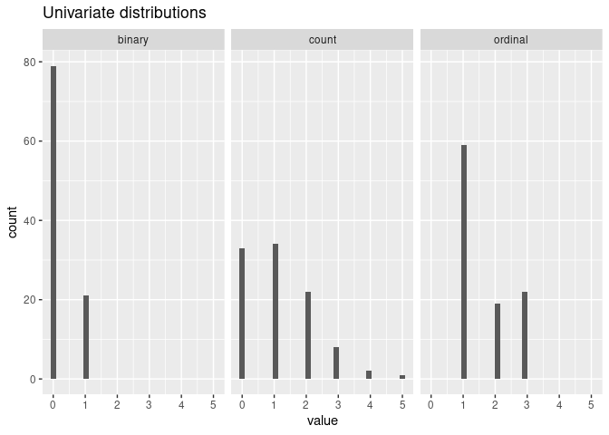
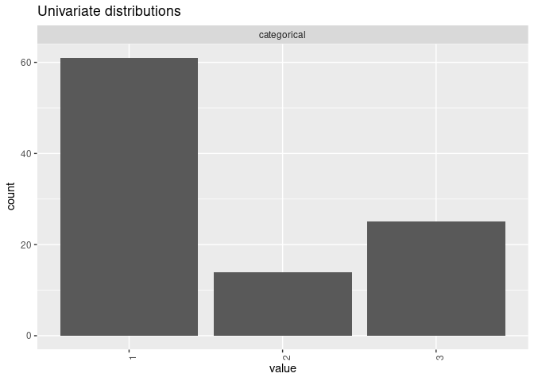
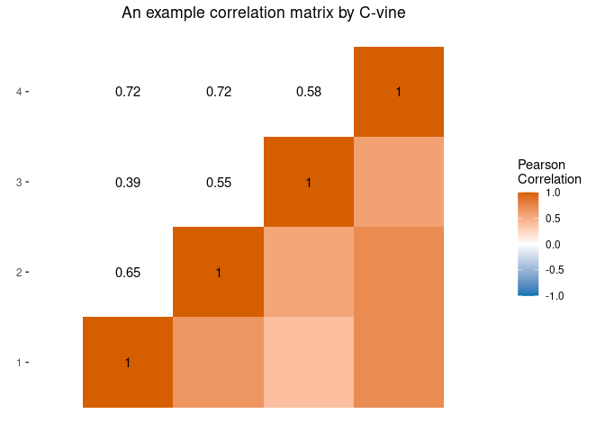
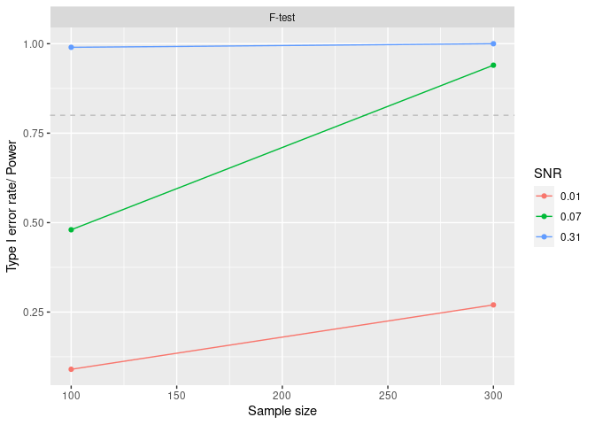
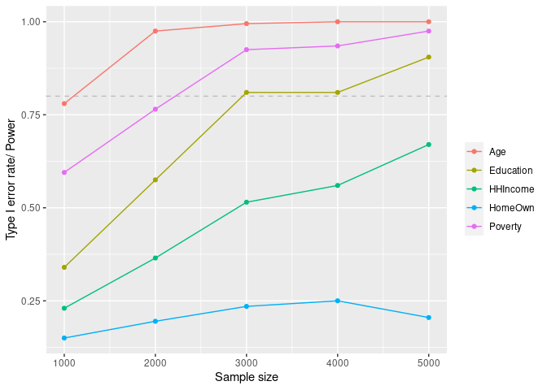

<!-- README.md is generated from README.Rmd. Please edit that file -->

# mpower

<!-- badges: start -->

[](https://github.com/phuchonguyen/mpower/actions/workflows/R-CMD-check.yaml)
<!-- badges: end -->

Estimating sample size and statistical power is an essential part of a
good study design. This package allows users to conduct power analysis
based on Monte Carlo simulations in settings in which considerations of
the correlations between predictors are important. It runs power
analyses given a data generative model and an inference model. It can
set up a data generative model that preserves dependence structures
among variables given existing data (continuous, binary, or ordinal) or
high-level descriptions of the associations. Users can generate power
curves to assess the trade-offs between sample size, effect size, and
power of a design.

This vignette presents tutorials and examples focusing on applications
for environmental mixtures studies where predictors tend to be
moderately to highly correlated. It easily interfaces with several
existing and newly developed analysis strategies for assessing
associations between exposures to mixtures and health outcomes. However,
the package is sufficiently general to facilitate power simulations in a
wide variety of settings.

## Installation

And the development version from
[GitHub](https://github.com/phuchonguyen/mpower) with:

``` r
# install.packages("devtools")
devtools::install_github("phuchonguyen/mpower")
```

## Tutorial

``` r
library(mpower)
library(dplyr)
library(magrittr)
library(tidyselect)
library(ggplot2)
```

To do power analysis using Monte Carlo simulations, we’ll need:

-   A generative model for the predictors. The predictors can be
    correlated and mixed-scaled. Use `MixtureModel()`.

-   A generative model for the outcome that describes the “true”
    relationships between the predictors and outcome. Use
    `OutcomeModel()`.

-   An inference model. Ideally, this would be the same as the
    generative model for the outcome. However, in practice our model can
    at best approximate the “true” predictor-outcome relationships. Use
    `InferenceModel()`.

-   A “significance” criterion and threshold for the inference model.
    For instance, the t-test in a linear regression has its p-value as
    the “significance” criterion, and a common threshold for statistical
    significance is p-value less than 0.05.

### Example 1: Power curve

#### Generate predictors with C-vine

We can manually specify the joint distribution of the predictors using
univariate marginal distributions and a guess of the correlation matrix.
To create four moderately associated mixed-scaled predictors:

``` r
G <- diag(1, 4)
G[upper.tri(G)] <- 0.6
G[lower.tri(G)] <- 0.6
xmod <- mpower::MixtureModel(method = "cvine", G = G, m = 50,
    cvine_marginals = list(binary = "qbinom(size=1, prob=0.2)",
                           count = "qpois(lambda = 1)",
                           ordinal = "qmultinom(probs=c(0.6, 0.2, 0.2))",
                           categorical = "qmultinom(probs=c(0.6, 0.2, 0.2))"),
    cvine_dtypes = list(categorical = "factor"))
mpower::mplot(xmod)
```



#### Define outcome models

Since we want to create a power curve, we need to supply a list of
outcome models with different “true” effect sizes:

``` r
ymod_list <- list(
  mpower::OutcomeModel(f = "1*binary + 1*I(categorical==1)", sigma = 1, family = "gaussian"),
  mpower::OutcomeModel(f = "0.5*binary + 0.5*I(categorical==1)", sigma = 1, family = "gaussian"),
  mpower::OutcomeModel(f = "0.2*binary + 0.2*I(categorical==1)", sigma = 1, family = "gaussian")
  )
```

#### Custom inference model

We define an overall F-test for linear regression as the inference model
and the p-value as the “significance” criterion:

``` r
# Define the ftest that returns a list of significance criteria
ftest <- function(y, x) {
  dat <- as.data.frame(cbind(y, x))
  lm_mod <- lm(y ~ ., data = dat)
  fstat <- summary.lm(lm_mod)$fstat
  fpval <- pf(fstat[1], fstat[2], fstat[3], lower.tail=F)
  names(fpval) <- "F-test"
  return(list(pval = fpval))
}
# define an InferenceModel using the F-test
imod <- mpower::InferenceModel(model = ftest, name = "F-test")
```

#### Run power analysis

We run power analysis for sample sizes 100 and 300 with 2 cores and 100
Monte Carlo simulations:

``` r
curve <- mpower::sim_curve(xmod, ymod_list, imod, s = 100,
                   n = c(100, 300), cores = 2)
```

We can get a table of summaries and a plot of the power:

``` r
curve_df <- mpower::summary(curve , crit = "pval", thres = 0.05, how = "lesser") 
#> 
#>  *** POWER CURVE ANALYSIS SUMMARY ***
#> Number of Monte Carlo simulations: 100
#> Number of observations in each simulation: 100 300
#> Data generating process estimated SNR (for each outcome model): 0.31 0.07 0.01
#> Inference model: F-test
#> Significance criterion: pval
#> Significance threshold: 0.05
#> 
#> |       | power|   n|  snr|
#> |:------|-----:|---:|----:|
#> |F-test |  0.99| 100| 0.31|
#> |F-test |  0.48| 100| 0.07|
#> |F-test |  0.09| 100| 0.01|
#> |F-test |  1.00| 300| 0.31|
#> |F-test |  0.94| 300| 0.07|
#> |F-test |  0.27| 300| 0.01|
```

``` r
mpower::plot_summary(curve , crit = "pval", thres = 0.05, how = "lesser")
```



### Example 2: Estimate a data generative model from existing data

We can estimate a data generative model for the predictors if we have
existing data on them. For example, here we use a copy of the NHANES
data from the 2015-2016 and 2017-2018 cycles.

For an estimation model, all data must be in numeric form. Categorical
variables should be converted to factors with numeric categories:

``` r
data("nhanes1518")
# preprocessing step
phthalates_names <- c("URXCNP", "URXCOP", "URXECP", "URXHIBP",
         "URXMBP", "URXMC1", "URXMCOH", "URXMEP", "URXMHBP", "URXMHH",
         "URXMHNC", "URXMHP", "URXMIB", "URXMNP", "URXMOH", "URXMZP")
covariates_names <- c("RIDAGEYR","INDHHIN2","BMXBMI","RIAGENDR")
# Get set of complete data only. Remaining 4800 obs.
nhanes_nona <- nhanes1518 %>%
  select(all_of(c(phthalates_names, covariates_names))) %>%
  filter(complete.cases(.))
```

#### Estimate the generative model:

We use a Bayesian semi-parametric Gaussian copula for this step. See
more in the R package `sbgcop`.

``` r
xmod <- mpower::MixtureModel(method = "estimation" , data = nhanes_nona,
    sbg_args = list(nsamp = 1000))
```

``` r
mplot(xmod, split=F)$corr
```


#### Define an outcome model:

``` r
ymod <- mpower::OutcomeModel(sigma = 1, family = "gaussian",
                     f = "0.5*RIDAGEYR + 0.3*I(RIAGENDR==1) +
                     0.3*URXMHH + 0.2*URXMOH + 0.2*URXMHP")
```

#### Estimate power using the F-test we define earlier:

``` r
power <- mpower::sim_power(xmod, ymod, imod, s=1000, n=100, snr_iter=4800,
                   cores = 2, errorhandling = "stop") 
```

``` r
power_df <- mpower::summary(power , crit = "pval", thres = 0.05, how = "lesser") 
#> 
#>  *** POWER ANALYSIS SUMMARY ***
#> Number of Monte Carlo simulations: 1000
#> Number of observations in each simulation: 100
#> Data generating process estimated SNR: 232.71
#> Inference model: F-test
#> Significance criterion: pval
#> 
#> Significance threshold:  0.05
#> 
#> |       | power|
#> |:------|-----:|
#> |F-test |     1|
```

### Example 3: Use the built-in inference models

#### Resample predictors from NHANES:

In this example, we generate predictors by resampling of a large
existing dataset. We load data from the R package NHANES and treat
ordinal Education and HHIncome as continuous variables.

``` r
library(NHANES)
data("NHANES")
nhanes_demo <- NHANES %>%
  select(BMI, Education, HHIncome, HomeOwn, Poverty, Age) %>%
  filter(complete.cases(.)) %>%
  mutate(Education = case_when(Education == "8th Grade" ~ 1,
                               Education == "9 - 11th Grade" ~ 2,
                               Education == "High School" ~ 3,
                               Education == "Some College" ~ 4,
                               Education == "College Grad" ~ 5),
         HHIncome = case_when(HHIncome == "more 99999" ~ 12,
                              HHIncome == "75000-99999" ~ 11,
                              HHIncome == "65000-74999" ~ 10,
                              HHIncome == "55000-64999" ~ 9,
                              HHIncome == "45000-54999" ~ 8,
                              HHIncome == "35000-44999" ~ 7,
                              HHIncome == "25000-34999" ~ 6,
                              HHIncome == "20000-24999" ~ 5,
                              HHIncome == "15000-19999" ~ 4,
                              HHIncome == "10000-14999" ~ 3,
                              HHIncome == " 5000-9999" ~ 2,
                              HHIncome == " 0-4999" ~ 1))
xmod <- mpower::MixtureModel(method = "resampling", data = nhanes_demo %>% select(- BMI))
```

#### Define the outcome model with a fitted model

We can generate outcomes from a previously fitted model.

``` r
lm_demo <- lm(BMI ~ Poverty*(poly(Age, 2) + HHIncome + HomeOwn + Education), data = nhanes_demo)
# wrapper function that takes a data frame x and returns a vector of outcome
f_demo <- function(x) {
  predict.lm(lm_demo, newdata = x)
}
ymod <- mpower::OutcomeModel(f = f_demo, family = "gaussian",
    sigma = sigma(lm_demo))
```

#### Use the built-in `glm` model

We need to give `glm` the family and formula inputs. See documentation
of `glm` for more options.

``` r
# pass the formula argument to glm()
imod <- mpower::InferenceModel(model = "glm", family = "gaussian",
    formula = y ~ Poverty*(poly(Age, 2) + HHIncome + HomeOwn + Education))
```

The model `lm_demo` is defined in the global environment, outside the
scope of the parallel processes. We need to pass `"lm_demo"` to the
`cluster_export` argument to make sure the variable is defined while
using parallelism.

``` r
curve <- mpower::sim_curve(xmod, ymod, imod,
    s = 200, n = seq(1000, 5000, 1000),
    cores = 2, errorhandling = "remove", snr_iter = 5000,
    cluster_export = c("lm_demo"))
```

``` r
curve_df <- mpower::summary(curve, crit = "pval", thres = 0.05, how = "lesser") 
#> 
#>  *** POWER CURVE ANALYSIS SUMMARY ***
#> Number of Monte Carlo simulations: 200
#> Number of observations in each simulation: 1000 2000 3000 4000 5000
#> Data generating process estimated SNR (for each outcome model): 0.03
#> Inference model: glm
#> Significance criterion: pval
#> Significance threshold: 0.05
#> 
#> |          | power|    n|  snr|
#> |:---------|-----:|----:|----:|
#> |Education | 0.340| 1000| 0.03|
#> |HHIncome  | 0.230| 1000| 0.03|
#> |HomeOwn   | 0.150| 1000| 0.03|
#> |Poverty   | 0.595| 1000| 0.03|
#> |Age       | 0.780| 1000| 0.03|
#> |Education | 0.575| 2000| 0.03|
#> |HHIncome  | 0.365| 2000| 0.03|
#> |HomeOwn   | 0.195| 2000| 0.03|
#> |Poverty   | 0.765| 2000| 0.03|
#> |Age       | 0.975| 2000| 0.03|
#> |Education | 0.810| 3000| 0.03|
#> |HHIncome  | 0.515| 3000| 0.03|
#> |HomeOwn   | 0.235| 3000| 0.03|
#> |Poverty   | 0.925| 3000| 0.03|
#> |Age       | 0.995| 3000| 0.03|
#> |Education | 0.810| 4000| 0.03|
#> |HHIncome  | 0.560| 4000| 0.03|
#> |HomeOwn   | 0.250| 4000| 0.03|
#> |Poverty   | 0.935| 4000| 0.03|
#> |Age       | 1.000| 4000| 0.03|
#> |Education | 0.905| 5000| 0.03|
#> |HHIncome  | 0.670| 5000| 0.03|
#> |HomeOwn   | 0.205| 5000| 0.03|
#> |Poverty   | 0.975| 5000| 0.03|
#> |Age       | 1.000| 5000| 0.03|
```

``` r
mpower::plot_summary(curve, crit = "pval", thres = 0.05, how = "lesser")
```



#### Usage of other built-in inference models

Here are examples of how to use other statistical inference models
included in the package.

###### Bayesian weighted sums (BWS)

“Significant” is when the credible intervals don’t include zero. We
access the 95% credible interval coverage with criterion “beta” and
threshold 0.05.

``` r
bws_imod <- mpower::InferenceModel(model = "bws", iter = 2000, family = "gaussian", refresh = 0)
bws_power <- mpower::sim_power(xmod, ymod, bws_imod, s = 100, n = 1000,
                       cores=2, snr_iter=1000, errorhandling = "stop",
                       cluster_export = c("lm_demo"))
```

###### Quantile G-computation

Similar to BWS but is a frequentist method. The significance criterion
is the p-value.

``` r
qgcomp_imod <- mpower::InferenceModel(model="qgc")
qg_power <- mpower::sim_power(xmod, ymod, qgcomp_imod, s = 100, n = 1000,
                       cores=2, snr_iter=1000, errorhandling = "remove")
```

###### Bayesian factor analysis with interactions

``` r
fin_imod <- InferenceModel(model="fin", nrun = 2000, verbose=F)
fin_power <- sim_power(xmod, ymod, fin_imod, s = 100, n = 1000,
                       cores=2, snr_iter=1000, errorhandling = "remove")
```

###### Bayesian model averaging

``` r
bma_imod <- InferenceModel(model="bma", glm.family = "gaussian")
bma_power <- sim_power(xmod, ymod, bma_imod, s = 100, n = 1000,
                       cores=2, snr_iter=1000, errorhandling = "remove")
```

###### Bayesian kernel machine regression

``` r
bkmr_imod <- InferenceModel(model = "bkmr", iter = 5000, verbose = F)
bkmr_power <- sim_power(xmod, ymod, bkmr_imod, s = 100, n = 1000,
                       cores=2, snr_iter=1000, errorhandling = "remove")
```

### Example 4: Logistic regression example

We show how to work with a binary outcome here. We load NHANES data from
the 2015-2016 and 2017-2018 cycles included in our package and define a
“true” outcome model that includes linear main effects and an
interaction. We check the power to detect these effects using a logistic
regression and a sample size of 2000 observations.

``` r
data("nhanes1518")
chems <- c("URXCNP", "URXCOP", "URXECP", "URXHIBP", "URXMBP", "URXMC1", "URXMCOH", "URXMEP",
"URXMHBP", "URXMHH", "URXMHNC", "URXMHP", "URXMIB", "URXMNP", "URXMOH", "URXMZP")
chems_mod <- mpower::MixtureModel(nhanes1518[, chems] %>% filter(complete.cases(.)),
                                  method = "resampling")
bmi_mod <- mpower::OutcomeModel(f = "0.2*URXCNP + 0.15*URXECP + 0.1*URXCOP*URXECP", family = "binomial")
logit_mod <- mpower::InferenceModel(model = "glm", family = "binomial")
logit_out <- mpower::sim_power(xmod=chems_mod, ymod=bmi_mod, imod=logit_mod,
                 s=100, n=2000, cores=2, snr_iter=5000)
```

``` r
logit_df <- summary(logit_out, crit="pval", thres=0.05, how="lesser")
#> 
#>  *** POWER ANALYSIS SUMMARY ***
#> Number of Monte Carlo simulations: 100
#> Number of observations in each simulation: 2000
#> Data generating process estimated SNR: 0.67
#> Inference model: glm
#> Significance criterion: pval
#> 
#> Significance threshold:  0.05
#> 
#> |        | power|
#> |:-------|-----:|
#> |URXCNP  |  0.18|
#> |URXCOP  |  1.00|
#> |URXECP  |  0.96|
#> |URXHIBP |  0.07|
#> |URXMBP  |  0.03|
#> |URXMC1  |  0.05|
#> |URXMCOH |  0.05|
#> |URXMEP  |  0.03|
#> |URXMHBP |  0.02|
#> |URXMHH  |  0.05|
#> |URXMHNC |  0.05|
#> |URXMHP  |  0.12|
#> |URXMIB  |  0.02|
#> |URXMNP  |  0.08|
#> |URXMOH  |  0.07|
#> |URXMZP  |  0.02|
```
